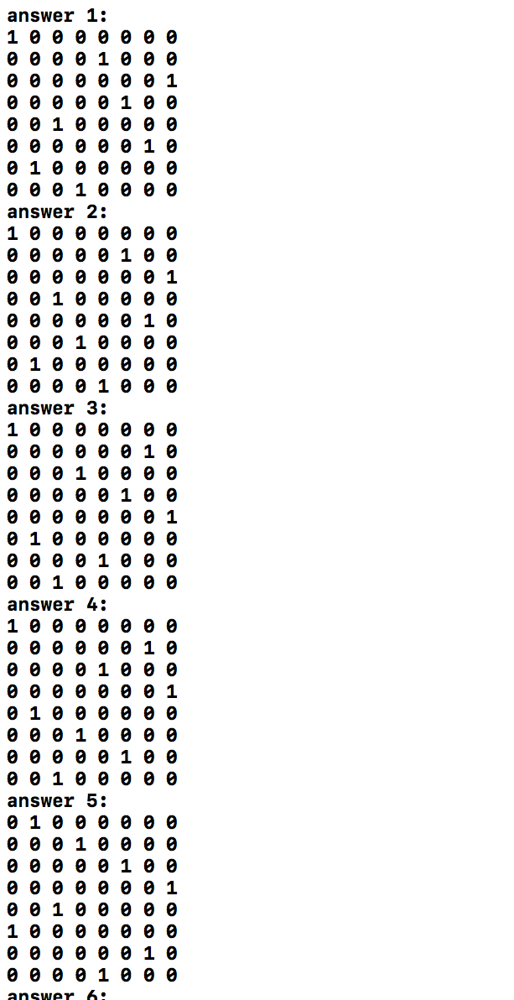
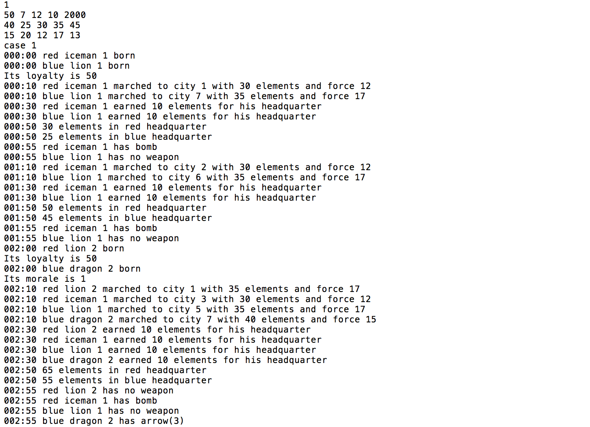
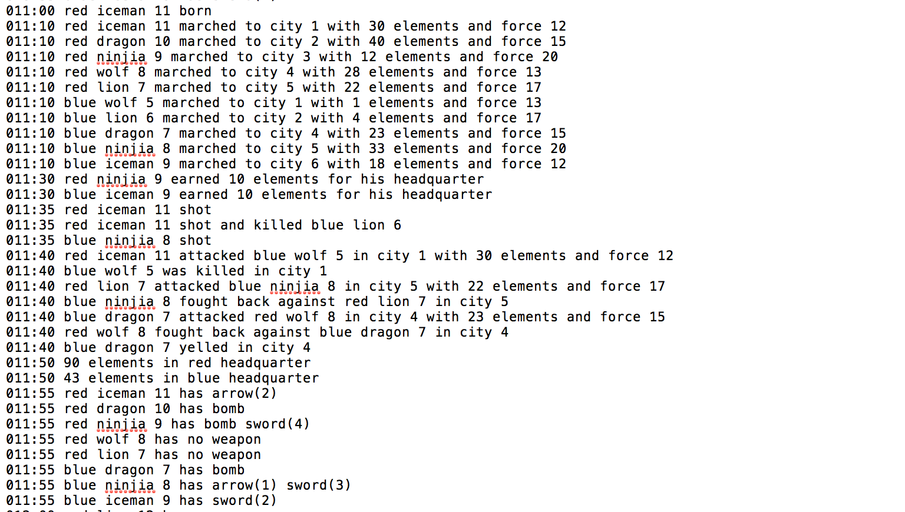
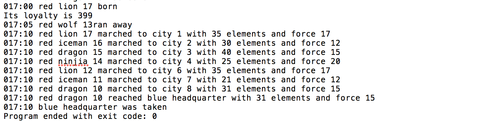
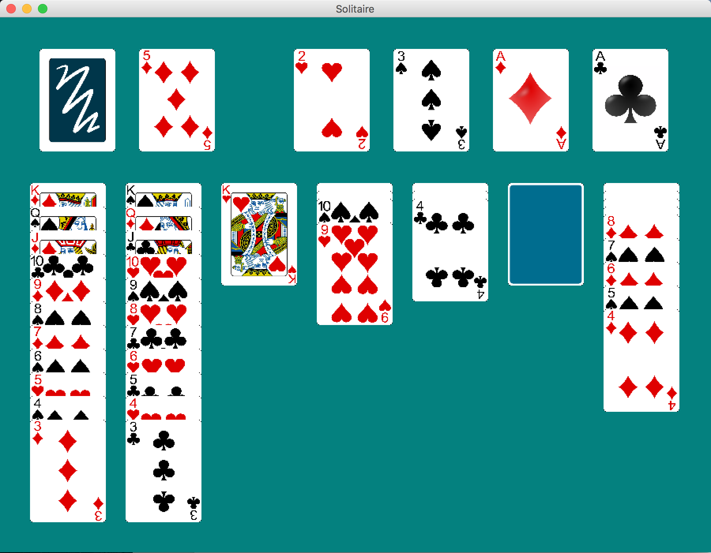
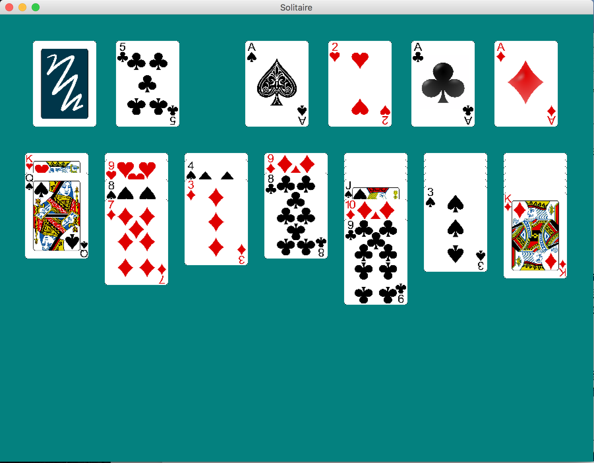

# 大作业

##一、面向对象实现八皇后的程序

###1. 输出样例

| 部分输出：                   |                         |
| ----------------------- | ----------------------- |
|  |  |

### 2. 代码简析

定义queen类代表一个皇后棋子：

```cpp
class queen {
private:
    int row;
    int column;
public:
    queen() {row = -1; column = -1;}
    void setqueen(int x, int y) {row = x; column = y;}
    int getcolumn() {return column;}
    int checkqueen(queen q[8]);
};
```

其中用`row`和`column`指示皇后棋子当前所在位置。初始时皇后不在棋盘内，定义其坐标为$(-1, -1)$.用`void setqueen(int x, int y)`方法来更新皇后棋子的位置，`int getcolumn()`来获取皇后棋子的列坐标。

用`int checkqueen(queen q[8])`来判断当前摆放方式是否符合要求，当发现新摆放的皇后棋子与之前摆放的棋子有冲突的时候返回0。

```cpp
int queen::checkqueen(queen q[8]) {
    if (row == 0) return 1;
    for (int k = 0; k <= row-1; k++) {
        //纵向只能有一枚皇后
        if (q[k].column == column) {
            return 0;
        }
        //右上至左下只能有一枚皇后
        if (q[k].row + q[k].column == row + column) {
            return 0;
        }
        //从左上至右下只能有一枚皇后
        if (q[k].row - q[k].column == row - column) {
            return 0;
        }
    }
    return 1;
}
```

定义回溯算法函数，在函数中调用皇后棋子数组对象。判断当前排放方式时候合规，如果不符合要求，则回溯；如果符合要求，则输出。遍历所有的可能性，最后也会输出所有符合要求的摆放方式。

```cpp
void solve(queen q[8], int i) {
    int j;
    for (j=0;j<8;j++)
    {
        //在其中一列放置皇后
        q[i].setqueen(i, j);
        //检查在该列放置皇后是否可行
        if (q[i].checkqueen(q)) {
            //若该列可放置皇后，且该列为最后一列，则找到一可行解，输出
            if(i == 7) output(q);
            //若该列可放置皇后，则向下一行，继续搜索、求解
            else solve(q, i+1);
        }
    }
}
```

简单定义出输出函数和main函数：

```cpp
void output(queen q[8]) {
    num++;
    cout<<"answer "<<num<<":\n";
    for (int i=0; i<8; i++) {
        for (int j=0; j<8; j++)
            if (q[i].getcolumn() == j) {
                cout<<"1 ";
            } else {
                cout<<"0 ";
            }
        cout<<endl;
    }
}

int main(){
    queen q[8];		//实例化出出八个皇后棋子，利用数组进行存储
    solve(q, 0);	//调用solve函数来利用遍历和回溯相结合的方法找出全部符合要求的解
    return 0;
}
```

### 3. 分析

此程序是第二次实验中的代码，在学习面向对象初期所写，现在看来并不是都利用面向对象的思想，solve函数的定义偏向面向过程的思路。改进：将solve函数也囊括进queen类中，作为其中的一个方法。

##二、魔兽世界

###1. 输出

已附上输出文件`out_example`.

```cpp
// Input Example
1
50 7 12 10 2000
40 25 30 35 45
15 20 12 17 13
```

| 部分输出                                     |
| :--------------------------------------- |
| 第一、二个小时的完整过程：包含了武士出生、前进、回收当前城市生产生命元给司令部、报告武器，司令部报告生命元等过程。由于刚开始武士从两地出发不会遇见，所以没有进攻等过程。红军司令部和蓝军司令部生产武士的顺序符合要求。 |
|  |
| 第十一个小时的完整过程：这时就存在武士之间相遇的过程了，可以看见其中完整的攻击、反击、击杀、欢呼等过程。同样第十一个小时也存在武士射箭将对方杀死的过程，在使用了一次弓箭之后，其次数变为2. |
|  |
| 最后一个小时的完整过程：在红军第二个士兵达到司令部时，红军司令部被占领，游戏结束。 |
|  |

### 2. 代码简析

####基本变量

将一些输入量定义为全局变量，减少多个类之间相互传递的复杂性。

```cpp
static int R = 0, K = 0, N = 0;
static int warriorHealth[5]{0};    		//dragon 、ninja、iceman、lion、wolf
static int warriorAttack[5]{0};    		//dragon 、ninja、iceman、lion、wolf
enum WarriorType {dragon = 0, ninjia, iceman, lion, wolf};
enum armType {sword = 0,bomb,arrow};	//定义武器类型为enum
```

#### 时间

利用时间类保存当前时刻的小时和分钟。

```cpp
class Clock {
private:
    int hours;
    int minutes;
public:
    Clock() {
        hours = 0;
        minutes = 0;
    }
    void click_clock(int min);			//时间经过min分钟
    const int getHours() {return hours;}
    const int getMinutes() {return minutes;}
    const int getTotalTime() {return hours*60 + minutes;}
    friend ostream& operator<< (ostream& out, Clock &clock);
  										//重载输出流，输出hours:minutes(xxx:xx)
};
```

####武器

|                   Arm类                   |
| :--------------------------------------: |
|  |

```cpp
class Arm {								//定义武器抽象类
protected:
    armType type;						//武器的种类
    int attack_point;					//武器的攻击力
public:
    Arm(armType _type):type(_type) {	//初始化
        attack_point = 0;
    }
    virtual int attack(Warrior* itself, Warrior* enemy) {return 0;}
  										//攻击敌人，用int记录攻击状态，在具体类中各有不同
    virtual bool exist() {return 1;}	//武器是否存在
    virtual string getType() = 0;		//返回武器类型的字符串
    int getTypeNumber() {return type;}	//返回武器类型的数值
    const int getAttackPoint() {return attack_point;}
  										//返回武器的攻击值
    virtual int print() {return 0;};	//报告武器
};
```

定义各个武器（包括Arrow、Bomb和Sword）的对外接口，在具体武器类中根据变化重写Arm类中的虚函数。

```cpp
class Sword:public Arm {
public:
    Sword(int warrior_attack_point): Arm(sword) {
        setAttackPoint((int)(warrior_attack_point*0.2));	
      									//Sword初始攻击为武士攻击的20%
    }
    int attack(Warrior *self, Warrior *enemy) {
        enemy->gethurt(attack_point);	//攻击一次Sword攻击力下降20%
        attack_point = (int)(attack_point * 0.8);
        return 1;						//返回的值表示发动攻击
    }
    bool exist() { if(attack_point > 0) return 1; else return 0;}
    string getType() {return "sword";}	//复写getType()虚函数
    int print() {
        cout << "sword(" << attack_point << ')';
        return 1;
    }
};
class Arrow:public Arm {
private:
    int R;								//Arrow攻击力
    int times;							//剩余使用次数
public:
    Arrow(int r): Arm(arrow), R(r) {
        times = 3;						//剩余使用次数初值为3
    }
    int attack(Warrior *self, Warrior *nextEnemy) {//enemy is in the next city
        nextEnemy->gethurt(R);			//攻击一次敌人生命值减少R
        times--;						//可用攻击次数减一
        if (nextEnemy->getHealth() <= 0) {
            return 2;					//enemy get killed.
        } else {
            return 1;=
        }
        return 0;						//返回攻击后的状态
    }
    bool exist() { if(times <= 0) return 0; else return 1;}
  										//剩余使用次数为0，则武器不存在
	...	//省略与Sword复写方式类似的函数
};
class Bomb:public Arm {
public:
    Bomb():Arm(bomb) {}
    int attack(Warrior *itself, Warrior *enemy) {
        bool setOff = (itself->getHealth() <= enemy->getTotalAttack());
        if (setOff) {					//当自己可能会被杀死时自爆
            itself->sethealth(0);
            enemy->sethealth(0);
        }
        return setOff;					//返回的值是，是否发生自爆
    }
    ...	//省略与Sword复写方式类似的函数
};
```

####武士

|                 Warrior类                 |
| :--------------------------------------: |
|  |

```cpp
class Warrior {
protected:
    int number;							//武士序号
    int health;							//武士生命值
    int attack;							//武士攻击力
    Arm *arm[3];						//武士武器
    int tempHealth;						//attack行为发生之前的生命值
public:
    Warrior(int _number, int _health, int _attack):number(_number), health(_health), attack(_attack) {		//初始化武器都不存在设为NULL
        arm[0] = NULL;					//arm[0]始终存储指向Sword的指针
        arm[1] = NULL;					//arm[1]始终存储指向Bomb的指针
        arm[2] = NULL;					//arm[2]始终存储指向Arrow的指针
    }
    void gethurt(int _attack) {health -= _attack;}	//遭受攻击
    void gethealed(int heal) {health += heal;}		//司令部发放生命元
    void inspired(int _attack) {attack += _attack;}	//iceman攻击力增加时调用
    bool alive() {return health>=0?1:0;}			//利用生命值来判断是否存活
    const int getTotalAttack() { ... }	//返回武士和其配备的Sword的攻击力之和
    virtual string getType() = 0;
    virtual void run() {}

  	//调用不同武器进行攻击，但是调用武器攻击的函数都是`attack(this, enemy)`，体现多态性
    virtual void fightback(Warrior *enemy) {
        if (arm[0] != NULL) {
            arm[0]->attack(this, enemy);
        }
        enemy->gethurt(attack);
    }
    virtual int fireArrow(Warrior *enemy) {
        if (arm[2] != NULL) {
            return arm[2]->attack(this, enemy);
        } else {
            return 0;
        }
    }
    virtual bool setOffBomb(Warrior *enemy) {
        if (arm[1] != NULL) {
            return arm[1]->attack(this, enemy);
        } else {
            return 0;
        }
    }
    
    //报告武器，武士的每个武器都调用`printArm(Arm* a)`方法
    virtual void reportArm(Clock* htime, string type) { ... } 
    bool printArm(Arm* a) { ... }		//当武器存在的时候调用Arm类中的`print();`方法
  	...	//省略一些对类变量get和set的函数
};
```

武器抽象类的其他函数：

```cpp
void Warrior::attacking(Warrior *enemy) {
    if (arm[0] != NULL) {
        arm[0]->attack(this, enemy);
        if (!arm[0]->exist()) {			//当Sword攻击值为0时，将arm[0]置为NULL
            arm[0] = NULL;
        }
    }
    enemy->gethurt(attack);
}

int Warrior::attackEnemy(Warrior *enemy, Clock *htime, string type, string enemyType, int cityNumber) {
    // there are four circumstances at both the beginning and the end:
    // 0. two warriors are both alive
    // 1. warrior is killed (by arrow) and enemy is alive
    // 2. warrior is alive and enemy is killed (by arrow)
    // 3. two warriors are both killed (by arrow)
    // return the state after the attack
    tempHealth = health;    //  recording the health before attack
    if (health > 0 && enemy->health > 0) {
        //combat happened
        cout << *htime << ' ' << type << ' ' << getType() << ' ' << number << " attacked " << enemyType << ' ' << enemy->getType() << ' ' << enemy->number << " in city " << cityNumber << " with " << health << " elements and force " << getTotalAttack() << endl;
        attacking(enemy);					//攻击
        if (enemy->health > 0) {			//如果敌人还活着的话就反击
            enemy->fightback(this);
            cout << *htime << ' ' << enemyType << ' ' << enemy->getType() << ' ' << enemy->number << " fought back against " << type << ' ' << getType() << ' ' << number << " in city " << cityNumber << endl;
        } else {
            cout << *htime << ' ' << enemyType << ' ' << enemy->getType() << ' ' << enemy->getNumber() << " was killed in city " << cityNumber << endl;
        }									//否则就输出敌人被击杀
        if (health <= 0) {					//如果自己被击杀的输出
            cout << *htime << ' ' << type << ' ' << getType() << ' ' << getNumber() << " was killed in city " << cityNumber << endl;
        }
    }
    if (health > 0 && enemy->health > 0) {	//根据结果返回上面四种状态值
        return 0;
    } else if (health <= 0 && enemy->health > 0) {
        return 1;
    } else if (health > 0 && enemy->health <= 0) {
        return 2;
    } else {
        return 3;
    }
}

void Warrior::getarmed(int type) {	//根据所传递进来的武器类型为武器数组初始化相应武器
    switch (type) {
        case sword:
            arm[0] = new Sword(attack);
            if (!arm[0]->exist()) {
                arm[0] = NULL;		//Sword初始化也可能攻击力为0，检查一下
            }
            break;
        case bomb:
            arm[1] = new Bomb();
            break;
        case arrow:
            arm[2] = new Arrow(R);
            break;
        default:
            break;
    }
}
```

具体的武士类，继承武士抽象类：

```cpp
class Dragon:public Warrior {
private:
    float morale;					//Dragon类增加了一个士气
public:
    int attackEnemy(Warrior *enemy, Clock *htime, string type, string enemyType, int cityNumber) {
        int circumstance = Warrior::attackEnemy(enemy, htime, type, enemyType, cityNumber);							//首先调用父类的攻击函数
        int state;
        switch (circumstance) {		//根据攻击敌人的结果修改士气值
            case 0:					//并根据结果返回四种结果状态值
                morale -= 0.2;
                state = 0;
                break;
            case 1:
                return 1;
            case 2:
                state = 2;
                morale += 0.2;
                break;
            default:
                return 3;
        }
        if (morale > 0.8) {			//如果士气大于0.8的话就欢呼
            cout << *htime << ' ' << type << ' ' << getType() << ' ' << number << " yelled in city " << cityNumber << endl;
        }
        return state;
    }
  ...								//忽略部分函数
};

class Ninjia:public Warrior {
public:
    Ninjia(int _number, int _health, int _attack): Warrior(_number, _health, _attack){
        getarmed(_number%3);		//有两个武器，初始化两次
        getarmed((number+1)%3);
        cout << getType() << ' ' << number << " born" << endl;
    }
    // ninjia never fight back
    void fightback(Warrior *enemy) { }  // do nothing
};
class Iceman:public Warrior {
private:
    int steps;						//记录步数
public:
    Iceman(int _number, int _health, int _attack):Warrior(_number, _health, _attack) {
        getarmed(_number%3);
        cout << getType() << ' ' << number << " born" << endl;
        steps = 0;					//刚出生的时候步数为0
    }
    string getType() {return "iceman";}
    int attackEnemy(Warrior *enemy, Clock *htime, string type, string enemyType, int cityNumber) {
        int state = Warrior::attackEnemy(enemy, htime, type, enemyType, cityNumber);
        refactor();					//根据步数修改状态
        return state;
    }
    void refactor() {
        if (!steps%2 && steps > 0) {
            if (health >= 9) {
                gethurt(9);
                inspired(20);
            } else {
                sethealth(1);
            }
        }
        steps++;					//攻击之后增加步数
    }
};
class Lion:public Warrior {
private:
    int loyalty;					//增加忠诚度
    int _K;							//和忠诚度降低值
public:
    Lion(int _number, int _health, int _attack, int headquarter_health):Warrior(_number, _health, _attack), loyalty(headquarter_health), _K(K) {
        getarmed(3);   				//lion has no arm, arm = NULL
        cout << getType() << ' ' << number << " born" << endl;
        cout << "Its loyalty is " << loyalty << endl;
    }
    string getType() {return "lion";}
    int attackEnemy(Warrior *enemy, Clock *htime, string type, string enemyType, int cityNumber) {
        int state = Warrior::attackEnemy(enemy, htime, type, enemyType, cityNumber);						//首先调用父类攻击函数
        switch (state) {			//根据攻击后的四种结果修改忠诚值
            case 0:
                loyalty -= _K;
                break;
            case 1:
                enemy->gethealed(tempHealth);
                break;				//如果自己死亡，则将生命值转移到敌人身上
            						//tempHealth记录的是Lion攻击之前的生命值
            default:
                break;
        }
        return state;
    }
    void run() {					//当忠诚度小于等于0的时候则lion逃跑
        if (K <= 0) {
            sethealth(0);
        }
    }
};
class Wolf:public Warrior {
private:
public:
    Wolf(int _number, int _health, int _attack):Warrior(_number, _health, _attack) {
        cout << getType() << ' ' << number << " born" << endl;
    }
    int attackEnemy(Warrior *enemy, Clock *htime, string type, string enemyType, int cityNumber) {
        int state = Warrior::attackEnemy(enemy, htime, type, enemyType, cityNumber);						//敌人死后，拣回自己没有的武器
        if (state == 2) {
            if (arm[0] == NULL) {
                arm[0] = enemy->getSword();
            }
            if (arm[1] == NULL) {
                arm[1] = enemy->getBomb();
            }
            if (arm[2] == NULL) {
                arm[2] = enemy->getArrow();
            }
        }
        return state;
    }
    ...
};
```

#### 城市

由于武士会从本方司令营走到对方司令营，且城市有自己属性，包括生命值和所插旗帜，所以建立城市类。其中的变量包含了城市自己的属性，已经红方和蓝方武士的Warrior类的指针，来指向在本城市的武士。通过这种指针包含的方式，来建立起城市与武士之间的联系。
此外，由于城市中包含武士的指针是自己方的武士和敌方武士的指针，所以同一个城市实际上对应两个City实例，一个包含在红方司令营中，一个包含在蓝方司令营中。由于城市的生命元是共享的，所以设为指针，双方都可以更改同一个值。

```cpp
enum Flag {blue, red, none};

class City {
private:
    int* life;				//城市生命元
    Flag flag;				//所插旗帜
    int red_combo;			//红方连赢次数
    int blue_combo;			//蓝方连赢次数
public:
    Warrior* warrior;		//己方武士
    Warrior* enemyWarrior;	//敌方武士
    City(Warrior* w, Warrior* enemy_w, int* _life):warrior(w), enemyWarrior(enemy_w), life(_life) {
        flag = none;		//初始化
        red_combo = 0;
        blue_combo = 0;
    }
    int warriorNumber() {	//计算城市中武士的数量
        if (warrior!=NULL && enemyWarrior!=NULL) {
            return 2;
        } else if (warrior==NULL && enemyWarrior==NULL) {
            return 0;
        } else {
            return 1;
        }
    }

    void failed(Flag type) {//如果输了的话将连赢次数置零
        if (type == red) {
            red_combo = 0;
        } else {
            blue_combo = 0;
        }
    }
    void success(Flag type, string stype, Clock* htime, int city) {
        if (type == red) {	//如果连赢两次更换旗帜
            red_combo++;
            if (red_combo >= 2) {
                flag = red;
                cout << *htime << ' ' << stype << " flag raised in city " << city << endl;
            }
        } else {
            blue_combo++;
            if ((blue_combo >= 2)) {
                flag = blue;
            }
        }
    }
};
	...						//忽略一些辅助函数
```


####司令部

|               Headquarter类               |
| :--------------------------------------: |
|  |

增加司令部类，主要包含的变量有每个司令营武士诞生的顺序，生产武士的编号，时间（设为指针），城市数组（指针），到达敌方司令部的武士个数。

```cpp
class Headquarter {
protected:
    int warriorBornOrder[5];
    int elements;
    int number;
    Clock* htime;
    City** cities;
    int arrived;
    void warriorBorn(Warrior **c, Warrior **enemy);
    virtual void born(Headquarter* enemyHeadquater) = 0;
    virtual Warrior* march(Headquarter* enemyHeadquater) = 0;
    virtual void shotArrow(Headquarter* enemyHeadquater) = 0;
public:
    Headquarter(int _life, Clock* _htime, City** _cities):elements(_life), htime(_htime), cities(_cities){
        arrived = 0;
        number = 1;
    }
    int scheduled(Headquarter* enemyHeadquater);
    virtual string getType() = 0;
    virtual Flag getFlagType() = 0;
    City** getcities() {return cities;}
    void getCityLife(City* city) {
        if (city->getlife() > 0) {
            elements += city->getlife();
            city->resetLife();
        }
    }
    void reportLife();
    void award(Warrior* warrior) {
        if (elements > 8) {
            warrior->gethealed(8);
            elements -= 8;
        }
    }
    bool arrive() {
        arrived++;
        if (arrived >= 2) {
            return 1;
        } else {
            return 0;
        }
    }
};


void Headquarter::warriorBorn(Warrior **c, Warrior **enemy) {
    switch (warriorBornOrder[number%5]) {
        case dragon:
            if (elements >= warriorHealth[dragon]) {
                cout << *htime << ' ' << getType() << ' ';
                *c = new Dragon(number, warriorHealth[dragon], warriorAttack[dragon], elements);
                *enemy = *c;
                number++;
                elements -= warriorHealth[dragon];
            }
            break;
        case ninjia:
            if (elements >= warriorHealth[ninjia]) {
                cout << *htime << ' ' << getType() << ' ';
                *c = new Ninjia(number, warriorHealth[ninjia], warriorAttack[ninjia]);
                *enemy = *c;
                number++;
                elements -= warriorHealth[ninjia];
            }
            break;
        case iceman:
            if (elements >= warriorHealth[iceman]) {
                cout << *htime << ' ' << getType() << ' ';
                *c = new Iceman(number, warriorHealth[iceman], warriorAttack[iceman]);
                *enemy = *c;
                number++;
                elements -= warriorHealth[iceman];
            }
            break;
        case lion:
            if (elements >= warriorHealth[lion]) {
                cout << *htime << ' ' << getType() << ' ';
                *c = new Lion(number, warriorHealth[lion], warriorAttack[lion], elements);
                *enemy = *c;
                number++;
                elements -= warriorHealth[lion];
            }
            break;
        case wolf:
            if (elements >= warriorHealth[wolf]) {
                cout << *htime << ' ' << getType() << ' ';
                *c = new Wolf(number, warriorHealth[wolf], warriorAttack[wolf]);
                *enemy = *c;
                number++;
                elements -= warriorHealth[wolf];
            }
            break;
    }
}

int Headquarter::scheduled(Headquarter* enemyHeadquater) {
    switch (htime->getMinutes()) {
        case 0:
            born(enemyHeadquater);
            break;
        case 5:
            //if lion'K <= 0 and lion is not in enemy's headquarter, lion runs
            for (int i = 0; i < N+2; i++) {
                if (cities[i]->warrior != NULL) {
                    cities[i]->warrior->run();
                    if (!cities[i]->warrior->getHealth()) {
                        cout << *htime << ' '<< getType() << ' ' << cities[i]->warrior->getType() << ' ' << cities[i]->warrior->getNumber() << "ran away" << endl;
                        // delete cities[i]->warrior;
                        cities[i]->warrior = NULL;
                    }
                }
            }
            break;
        case 10: {
            Warrior* w = march(enemyHeadquater);
            for (int i = 0; i < N+2; i++) {
                if (cities[i]->warrior!=NULL) {
                    cout << *htime << ' ' << getType() << ' ' << cities[i]->warrior->getType() << ' ' << cities[i]->warrior->getNumber() << " marched to city " << i << " with " << cities[i]->warrior->getHealth() << " elements and force " << cities[i]->warrior->getAttack() << endl;
                }
            }
            if (w != NULL) {
                int success = arrive();
                cout << *htime << ' ' << getType() << w->getType() << ' ' << w->getNumber() << " reached " << enemyHeadquater->getType() << " headquarter with " <<  w->getHealth() << " elements and force " <<  w->getAttack() << endl;
                if (success) {
                    cout << *htime << ' ' << enemyHeadquater->getType() << " headquarter was taken" << endl;
                    return 1;
                }
            }
            break;
        }
        case 20:
            for (int i = 0; i < N+2; i++) {
                cities[i]->setlife();
            }
            break;
        case 30:
            for (int i = 0; i < N+2; i++) {
                if (cities[i]->warrior!=NULL && cities[i]->enemyWarrior==NULL) {
                    getCityLife(cities[i]);
                    cout << *htime << ' ' << getType() << ' ' << cities[i]->warrior->getType() << ' ' << cities[i]->warrior->getNumber() << " earned 10 elements for his headquarter" << endl;
                }
            }
            break;
        case 35:
            shotArrow(enemyHeadquater);
            break;
        case 38:
            for (int i = 0; i < N+2; i++) {
                if (cities[i]->warrior != NULL && cities[i]->enemyWarrior != NULL) {
                    if (cities[i]->warrior->getHealth() > 0 && cities[i]->warrior->setOffBomb(cities[i]->enemyWarrior)) {
                        cout << *htime << ' ' << getType() << ' ' << cities[i]->warrior->getType() << ' ' << cities[i]->warrior->getNumber() << " used a bomb and killed " << enemyHeadquater->getType() << cities[i]->enemyWarrior->getType() << cities[i]->enemyWarrior->getNumber() << endl;
                        //cities[i].warrior->~Warrior();
                        cities[i]->warrior = NULL;
                        //cities[i].enemyWarrior->~Warrior();
                        cities[i]->enemyWarrior = NULL;
                    }
                }
            }
            break;
        case 40:
            for (int i = 0; i < N+2; i++) {
                int flag = cities[i]->getFlag() == getFlagType() || (cities[i]->getFlag() == none && i%2 == getFlagType());
                if (cities[i]->warrior!=NULL && cities[i]->enemyWarrior!=NULL && flag) {
                    int state = cities[i]->warrior->attackEnemy(cities[i]->enemyWarrior, htime, getType(), enemyHeadquater->getType(), i);
                    switch (state) {
                        //0. 两人都没死
                        //1. 自己（已经被箭射）死了，敌人没有
                        //2. 自己没死，敌人（被箭射）死了
                        //3. 两人都（被箭射）死了
                        case 1:
                            cities[i]->failed(getFlagType());
                            cities[i]->success(enemyHeadquater->getFlagType(), enemyHeadquater->getType(), htime, i);
                            cities[i]->warrior = NULL;
                            enemyHeadquater->getcities()[i]->enemyWarrior = NULL;
                            enemyHeadquater->award(cities[i]->enemyWarrior);
                            break;
                        case 2:
                            cities[i]->failed(enemyHeadquater->getFlagType());
                            cities[i]->success(getFlagType(), getType(), htime, i);
                            cities[i]->enemyWarrior = NULL;
                            enemyHeadquater->getcities()[i]->warrior = NULL;
                            award(cities[i]->warrior);
                            break;
                        default:    //case 0/3
                            cities[i]->failed(getFlagType());
                            cities[i]->failed(enemyHeadquater->getFlagType());
                            break;
                    }
                }
            }
            for (int i = 0; i < N+2; i++) {
                if (cities[i]->warrior != NULL && cities[i]->enemyWarrior == NULL) {
                    getCityLife(cities[i]);
                }
            }
            break;
        case 50:
            cout << *htime << ' ' << elements << " elements in " << getType() << " headquarter" << endl;
            break;
        case 55:
            for (int i = 0; i < N+2; i++) {
                if (cities[i]->warrior != NULL) {
                    cities[i]->warrior->reportArm(htime, getType());
                }
            }
            break;
        default:
            //do nothing
            break;
    }
    return 0;
}
```

定义红方司令部和蓝方司令部，继承父类：

```cpp
class RedHeadquarter: public Headquarter {
public:
    RedHeadquarter(int _life, Clock* _htime, City** _cities):Headquarter(_life, _htime, _cities) {
        warriorBornOrder[1] = iceman;			//初始化武士出生的顺序
        warriorBornOrder[2] = lion;
        warriorBornOrder[3] = wolf;
        warriorBornOrder[4] = ninjia;
        warriorBornOrder[0] = dragon;
    }
    void born(Headquarter* enemyHeadquater) {
        warriorBorn(&cities[0]->warrior, &enemyHeadquater->getcities()[0]->enemyWarrior);
    }
    ...											//省略部分函数
};
class BlueHeadquarter: public Headquarter {
public:
    BlueHeadquarter(int _life, Clock* _htime, City** _cities):Headquarter(_life, _htime, _cities) {
        warriorBornOrder[1] = lion;
        warriorBornOrder[2] = dragon;
        warriorBornOrder[3] = ninjia;
        warriorBornOrder[4] = iceman;
        warriorBornOrder[0] = wolf;
    }
    void born(Headquarter* enemyHeadquater) {
        warriorBorn(&cities[N+1]->warrior, &enemyHeadquater->getcities()[N+1]->enemyWarrior);
    }
	...											//省略部分函数
};
//由于红蓝双方的司令部所在位置以及行军方向不一样，所以需要重写，修改了城市遍历的顺序
Warrior* RedHeadquarter::march(Headquarter* enemyHeadquater) {
    for (int i = N+1; i > 0; i--) {
        cities[i]->warrior = cities[i-1]->warrior;
        enemyHeadquater->getcities()[i]->enemyWarrior = enemyHeadquater->getcities()[i-1]->enemyWarrior;
    }
    //return warrior reached enemy's headquarter
    cities[0]->warrior = NULL;
    enemyHeadquater->getcities()[0]->enemyWarrior = NULL;
    return cities[N+1]->warrior;
}
Warrior* BlueHeadquarter::march(Headquarter* enemyHeadquater) {
    for (int i = 0; i < N+1; i++) {
        cities[i]->warrior = cities[i+1]->warrior;
        enemyHeadquater->getcities()[i]->enemyWarrior = enemyHeadquater->getcities()[i+1]->enemyWarrior;
    }
    cities[N+1]->warrior = NULL;
    enemyHeadquater->getcities()[N+1]->enemyWarrior = NULL;
    return cities[0]->warrior;
}
//同样由于红蓝双方行军方向不一样，在使用Arrow的时候对于武士的“下一个城市”是不一样的，需要重写，主要修改了对于武士下一个城市的定义
void RedHeadquarter::shotArrow(Headquarter* enemyHeadquater) {
    for (int i = 0; i < N+2; i++) {
        if (cities[(i)%(N+2)]->warrior != NULL && cities[(i+1)%(N+2)]->enemyWarrior != NULL) {
            int state = cities[i]->warrior->fireArrow(cities[(i+1)%(N+2)]->enemyWarrior);
            if (state) {
                cout << *htime << ' ' << getType() << ' ' << cities[i]->warrior->getType() << ' ' << cities[i]->warrior->getNumber() << " shot" << endl;
                if (state == 2) {
                    cout << *htime << ' ' << getType() << ' ' << cities[i]->warrior->getType() << ' ' << cities[i]->warrior->getNumber() << " shot and killed " << enemyHeadquater->getType() << cities[(i+1)%(N+2)]->enemyWarrior->getType() << cities[(i+1)%(N+2)]->enemyWarrior->getNumber() << endl;
                }
            }
        }
    }
}
void BlueHeadquarter::shotArrow(Headquarter* enemyHeadquater) {
    for (int i = 0; i < N+2; i++) {
        if (cities[i%(N+2)]->warrior != NULL && cities[(i+N+1)%(N+2)]->enemyWarrior != NULL) {
            int state = cities[i]->warrior->fireArrow(cities[(i+N+1)%(N+2)]->enemyWarrior);
            if (state) {
                cout << *htime << ' ' << getType() << ' ' << cities[i]->warrior->getType() << ' ' << cities[i]->warrior->getNumber() << " shot" << endl;
                if (state == 2) {
                    cout << *htime << ' ' << getType() << ' ' << cities[i]->warrior->getType() << ' ' << cities[i]->warrior->getNumber() << " shot and killed " << enemyHeadquater->getType() << cities[(i+N+1)%(N+2)]->enemyWarrior->getType() << cities[(i+N+1)%(N+2)]->enemyWarrior->getNumber() << endl;
                }
            }
        }
    }
}

```

#### Main函数

```cpp
int main() {
    int M, T, times;
    cin >> times;
    for (int j = 0; j < times; j++) {
        // M elements points in each headquarter
        // N cities
        // R - arrow attack points
        // K - lion reduce K loyalty points, when it does not kill the enemy
        // T - output all events till T minutes. 0 <= T <= 5000
        cin >> M >> N >> R >> K >> T;
        // initial elements points of each warrior: dragon 、ninja、iceman、lion、wolf
        for (int i = 0; i < 5; i++) {
            cin >> warriorHealth[i];
        }
        // attack points of each warrior: dragon 、ninja、iceman、lion、wolf
        for (int i = 0; i < 5; i++) {
            cin >> warriorAttack[i];
        }
        cout << "case " << times << endl;

        //initalize city
        int **life = new int*[N+2];
        for (int i = 0; i < N+2; i++) {
            life[i] = new int(0);
        }
        Warrior* redWarriors[N+2];
        Warrior* blueWarriors[N+2];
        for (int i = 0; i < N+2; i++) {
            redWarriors[i] = NULL;
            blueWarriors[i] = NULL;
        }
        City** redCities = new City*[N+2];
        City** blueCities = new City*[N+2];
        for (int i = 0; i < N+2; i++) {
            redCities[i] = new City(redWarriors[i], blueWarriors[i], life[i]);
            blueCities[i] = new City(blueWarriors[i], redWarriors[i], life[i]);
        }
        Clock* t = new Clock;
        RedHeadquarter redHeadquarter(M, t, redCities);
        BlueHeadquarter blueHeadquarter(M, t, blueCities);
        
        int end = 0;
        while (t->getTotalTime() < T && !end) {
            end += redHeadquarter.scheduled(&blueHeadquarter);
            end += blueHeadquarter.scheduled(&redHeadquarter);
            t->click_clock(1);
        }
    }
    return 0;
}
```

####不足

由于红蓝双方很多属性都是共用的，武士和兵器以及城市之间是独立存在的，所以这些变量很多都设置成了指针。同样在Debug的过程中出现的很多问题，也都是由于指针没有设置正确导致的。通过本次实验我对与设计面向对象的不同类之间的组合关系有了更深入的了解，理解了什么时候类中的包含应该使用指针，什么时候不适用指针等；对指针的应用也有了更深入的认识和理解。

实验中同样还存在着一些瑕疵没有改进：

1. 内存管理：没有实现delete 程序在运行结束后统一释放所有new出来的变量
2. 每次都需要修改city和enemyCity对同一英雄的指针，应该把他们指向同一个对英雄的指针，而不是直接指向英雄指针

## 三、纸牌游戏（JAVA）

###1. 输出

|              输出               |
| :---------------------------: |
|           样例1：初始状态            |
|  |
|              样例2              |
|  |
|              样例3              |
|  |

## 2. 代码简析

首先定义Card类，其中的变量用以定义一张卡片的宽度、高度、花色、点数、位置、是否正面朝上，以及正面和背面对应的图案，并且包含了画图等重要函数。除此之外，将扑克牌的花色定义为enum。

```java
public class Card {
    final public static int width = 96;		//卡片宽度
    final public static int height = 130;	//卡片高度
    private boolean front;					//是否正面朝上
    private int num;						//点数
    private CardShape type;					//花色
    private int x;							//左上角位置x坐标
    private int y;							//左上角位置y坐标
    private Image imageFront;				//正面对应图案
    private static Image imageBack;			//背面对应图案
  
    public enum CardShape {					//将扑克牌的花色定义为enum
        HEARTS("hearts"), SPADES("spades"), DIAMONDS("diamonds"), CLUBS("clubs");
		...
    }
    void draw (Graphics g) { ... }			//将扑克牌向上的一面画出来
  	...										//省略了设置和获取私有变量的函数
}
```

Card类中用到了一个Image类，用来表示卡片某一面的图案，其中包含的变量有图案的图片、截选出来的图案的高度和宽度，以及这部分的全部像素点。

```java
public class Image {
    private BufferedImage bufferImage;
    private int width;
    private int height;
    final private int[] pixels;
    final private int[] clear;
  
    public Image(final String fileName) { ... }	//从路径名导入图片，并截选出合适的图案大小存储下来
  	
  	...	//省略了设置和获取私有变量的函数
}
```

定义牌堆，其中主要的变量有：牌堆位置，牌栈和底色。其中牌堆位置是用左上角的位置表示的，牌栈存放所有在堆中的牌，遵循先进后出的方式，底色是当该牌堆中没有牌的时候展示的图案。

```java
public class CardPile {
    protected final int x;							//牌堆左上角x坐标
    protected final int y;							//牌堆左上角y坐标
    public final Stack<Card> thePile;				//牌堆栈
    public static Image buttomPic;					//底部图案

    public CardPile (int xl, int yl) { ... }		//初始化，给牌堆的位置、栈和底部图案赋值
    public Card top() { ... }						//如果牌堆不为空的话，获取牌堆最上方的一张牌
    public  boolean isEmpty() { ... }				//判断牌堆是否为空
    public  Card pop() { ... }						//从牌堆最上方取一张牌，该牌从牌栈中出栈
    public void addCard (Object card){				//添加卡，向牌堆栈入栈
        thePile.push((Card)card);
    }
	public void display (Graphics g){ ... }			//画出牌堆，如果不为空，就画出最上边一张牌的图案
	...												//忽略部分辅助函数
}

```

```java
public class DeckPile extends CardPile {
    public DeckPile (int x, int y) {				//初始化
        super(x, y);
    }
}
```

定义丢弃堆，继承牌堆：

```java
public class DiscardPile extends CardPile {
    public DiscardPile (int x, int y) {				//初始化
        super (x, y);
    }
    public void addCard (Object card){				//重写addCard的函数，增加翻页的动作
        Card cards = (Card)card;					//即，当添加到丢弃堆时，牌面翻上
        if (!(cards.isFront())) {
            cards.setFaceup(true);
        }
        thePile.push(cards);
    }
}
```

定义花色牌堆，增加一个`public boolean isCanAdd(Card card)`函数，来判断card是否可以添加到这个牌堆中：

```java
public class SuitPile extends CardPile {
    public SuitPile (int x, int y) { super(x, y); }
    public boolean isCanAdd(Card card) {
        if (isEmpty()) {
            return card.getNum() == 0;
        }
        Card topCard = top();
        return (card.getType() == topCard.getType()) && (card.getNum() ==  topCard.getNum() + 1);	//如果花色相同，点数比花色牌堆最上面的一张牌大一才能添加
    }
}
```

定义桌面牌堆，继承牌堆：

```java
public class TablePile extends CardPile {
    private int notFlipNum;							//开始时未翻面的牌数
    private int cardNum;							//开始时总牌数，包含未翻面的牌和一张翻面的牌
    private final static int separation  = 30;		//下一张牌比上一张牌下移seperation
    final static int unFlipCardSeparation = 10;
    public TablePile(int x, int y,int notFlipNum){	//初始化
        super(x, y);
        this.notFlipNum = notFlipNum;
        cardNum = notFlipNum+1;
    }
    @Override
    public boolean includes(int tx, int ty) { ... }	//根据改变的变量，重写基类中的函数
    @Override
    public int select(int tx, int ty) { ... }
    @Override
    public void addCard(Object card) { ... }
    @Override
    public Card pop() { ... }
  
    public boolean isCanAdd(Card card){				//增加对是否能增加牌的判断
        if ( isEmpty()) {							//当牌堆为空的时候，只有K才能放
            return card.getNum() == 12;
        }
        Card topCard = top();
        return (card.getColor() != topCard.getColor()) && (card.getNum() ==  topCard.getNum()-1 );								//否则只能相反颜色且点数减一才能添加
    }

    @Override
    public void display(Graphics g) {				//重写display函数
        if (isEmpty()){								//为空时，显示底牌
            g.drawImage(buttomPic.getBufferedImage(), this.x,this.y, Card.width, Card.height, null);
        }
        else{
            int localy = y;
            for (Enumeration e = thePile.elements(); e.hasMoreElements(); ) {
                //依次显示牌堆中所有的牌，下一张牌覆盖上一张牌且下移一段距离
                Card aCard = (Card) e.nextElement();
                aCard.setX(x);
                aCard.setY(localy);
                aCard.draw(g);
                if(aCard.isFront()) {
                    localy += separation;
                } else {
                    localy += unFlipCardSeparation;
                }
            }
        }
    }
    ...	//省略set和get相应私有变量的函数
}
```

定义移动牌堆类：

```java
public class MoveCardPile {
    private ArrayList<Card> cardList;			//移动的多张牌
    private CardPile fromPile;					//原始牌堆
    private int startx;
    private int starty;
    private final static int separation  = 30;	//同样，下一张叠在上一张上，且中间隔separation
    public MoveCardPile(){						//初始化
        cardList = new ArrayList();
    }
    public int size() { ... }					//移动牌数的数目
    public boolean isEmpty() { ... }			//是否为空
    public void addCard(Card card) { ... }		//向数组中添加牌，放在位置0
    public Card getCard(){ ... }				//向数组中获得位置0的牌
    public Card removeCard(){ ... }				//移除数组中位置0的牌
    public ArrayList<Card> clear(){ ... }		//不选中任何牌，将数组清空
    public void display(Graphics g, int tx, int ty, int oldx, int oldy){ ... }	//显示
    public CardPile getFromPile() { ... }
    public void setFromPile(CardPile fromPile, boolean flag) { ...}
    public void setFromPile(CardPile fromPile, int i) { ... }
}
```

在定义完各个基本元素牌和牌堆之后，定义游戏的基本参数和方法：

```java
class Game {
    private static final ArrayList<Card> allCard;	//所有牌
    static final CardPile[] allPiles;				//所有牌堆
    private static final DeckPile deckPile;			//待用堆
    private static final DiscardPile discardPile;	//弃用堆
    private static final TablePile[] tablePile;		//桌面堆
    private static final SuitPile[] suitPile;		//花色堆
    static final MoveCardPile moveCard;				//移动牌堆

    static {
        allCard = new ArrayList<Card>();
        for (int i = 0; i < 4; i++) {
            Card.CardShape type = Card.CardShape.fromInteger(i);
            for (int j = 0; j <= 12; j++) {
                allCard.add(new Card(j, type));		//初始化所有牌，一共52张
            }
        }
        Random generator = new Random();
        for (int i = 0; i < 52; i++) {				//洗牌，将52张牌的顺序打乱
            int j = Math.abs(generator.nextInt() % 52);
            Card temp = allCard.get(i);
            allCard.set(i, allCard.get(j));
            allCard.set(j, temp);
        }

        allPiles = new CardPile[13];				//初始化各个牌堆
        suitPile = new SuitPile[4];
        tablePile = new TablePile[7];
		
        //初始化牌堆并定义牌堆显示位置
        allPiles[0] = deckPile = new DeckPile(50, 40);
        allPiles[1] = discardPile = new DiscardPile(50 + Card.width + 30, 40);
        for (int i = 0; i < 4; i++) {
            allPiles[2 + i] = suitPile[i] =
                    new SuitPile(50 + Card.width + 30 + Card.width + 100 + (30 + Card.width) * i, 40);
        }
        for (int i = 0; i < 7; i++) {
            allPiles[6 + i] = tablePile[i] =
                    new TablePile(38 + (25 + Card.width) * i, 40 + Card.height + 40, i);
        }
        for (int i = 0; i < 7; i++) {
            ArrayList<Card> al = new ArrayList<Card>();
            for (int j = 0; j < tablePile[i].getCardNum(); j++) {
                al.add(allCard.remove(allCard.size() - 1));
            }
            tablePile[i].addCard(al);
            tablePile[i].setCardNum(tablePile[i].getNotFlipNum() + 1);
            tablePile[i].top().setFaceup(true);
        }
        int rest = allCard.size();
        for (int i = 0; i < rest; i++) {
            deckPile.addCard(allCard.remove(allCard.size() - 1));
        }
        moveCard = new MoveCardPile();
    }
	
    private static void transferFromDiscardToDeck() {	//在翻完待用牌堆之后，将弃用堆中的牌移回来
        while (!(discardPile.isEmpty())) {
            Card card = discardPile.pop();
            card.setFaceup(false);
            deckPile.addCard(card);
        }
    }

  	//判断是否选中牌堆
    static boolean testDeckPile(int x, int y) { ... }
    static boolean testDisCardPile(int x, int y) { ... }
    static boolean testTablePile(int x, int y) { ... }

    static boolean isCanAddToSuitPile(int x, int y) {	//判断是否能将牌添加到花色牌堆
        if (moveCard.size() == 1) {
            for (int i = 0; i < 4; i++) {
                if (suitPile[i].includes(x, y)) {
                    if (suitPile[i].isCanAdd(moveCard.getCard())) {
                        suitPile[i].addCard(moveCard.removeCard());
                        return true;
                    }
                }
            }
        }
        return false;
    }
      static boolean isCanAddToSuitPile() {
        if (moveCard.size() == 1) {
            for (int i = 0; i < 4; i++) {
                if (suitPile[i].isCanAdd(moveCard.getCard())) {
                    suitPile[i].addCard(moveCard.removeCard());
                    return true;
                }
            }
        }
        return false;
    }
    static boolean isWin() {							//当每个花色牌堆中的牌都是13时，游戏胜利
        for (int i = 0; i < 4; i++) {
            if (suitPile[i].getSize() != 13) {
                return false;
            }
        }
        return true;
    }
    static boolean isCanAddtoTablePile(int x, int y) {	//是否可以添加到桌面堆
        for (int i = 0; i < 7; i++) {
            if (tablePile[i].includes(x, y)) {
                if (tablePile[i].hashCode() != moveCard.getFromPile().hashCode()) {
                    if (tablePile[i].isCanAdd(moveCard.getCard())) {
                        tablePile[i].addCard(moveCard.clear());
                        return true;
                    }
                }
            }
        }
        return false;
    }
    static void refreshTablePile() {					//初始化桌面牌的时调用
        for (int i = 0; i < 7; i++) {
            if (tablePile[i].top() != null) {
                if (!(tablePile[i].top().isFront())) {
                    tablePile[i].top().setFaceup(true);
                    tablePile[i].setNotFlipNum(tablePile[i].getNotFlipNum() - 1);
                }
            }
        }
    }
    static void returnToFromPile() {					//将选中的牌返回原来的牌堆
        if (moveCard.getFromPile() != null) {
            if (moveCard.getFromPile().hashCode() == discardPile.hashCode()) {
                while (!(moveCard.isEmpty())) {
                    moveCard.getFromPile().addCard(moveCard.removeCard());
                }
            } else {
                moveCard.getFromPile().addCard(moveCard.clear());
            }
        }
    }
}
```

定义Solitaire类，主要定义了鼠标的选中控制功能：

```java
public class Solitaire extends JPanel implements MouseListener, ActionListener,MouseMotionListener {
    private boolean isDrag = false;
    private int x;
    private int y;
    private int oldx;
    private int oldy;
    private boolean win = false;
    private card.Image winBanner;
  
    public Solitaire() {						//初始化
        setSize(900, 700);						//设置游戏窗口大小
        setLayout(null);
        addMouseListener (this);				//添加对鼠标及其动作的监听
        addMouseMotionListener(this);
    }

    @Override
    protected void paintComponent(Graphics g) {	
        BufferedImage bi = new BufferedImage(900, 700, 1);
        Graphics2D G = bi.createGraphics();		//设置游戏窗口基本参数（大小和颜色等）并显示
        G.clearRect(0, 0, 900, 700);
        G.setColor(new Color(0x04817F));
        G.fillRect(0, 0, 900, 700);
        for (int i = 0; i < 13; i++) {
            Game.allPiles[i].display(G);		//显示各个牌堆
        }
        Game.moveCard.display(G, x, y, oldx, oldy);
        if (win) {
            if (winBanner == null) {
                winBanner = new Image("/PNG-cards/win.png");
            }
            G.drawImage(winBanner.getBufferedImage(),450 - winBanner.getWidth() / 2, 350 - winBanner.getHeight() / 2, null);
        }
        g.drawImage(bi, 0, 0, null);
    }
	
    //根据游戏的功能，重写鼠标控制方法
    @Override
    public void mouseClicked(MouseEvent e) { ... }
    @Override
    public void mousePressed(MouseEvent e) { ... }
    @Override
    public void mouseReleased(MouseEvent e) { ... }
    @Override
    public void mouseDragged(MouseEvent e) { ... }
}
```

定义SolitaireGame，包含了main方法。

```java
public class SolitaireGame extends JFrame {
    public SolitaireGame(){
        setSize(900, 700);
        setTitle("Solitaire");
        setLayout(null);
        setDefaultCloseOperation(DISPOSE_ON_CLOSE);
        setVisible(true);
        Solitaire sp = new Solitaire();
        add(sp);
    }
    public static void main(String[] args) {
        new SolitaireGame();
    }
}
```

