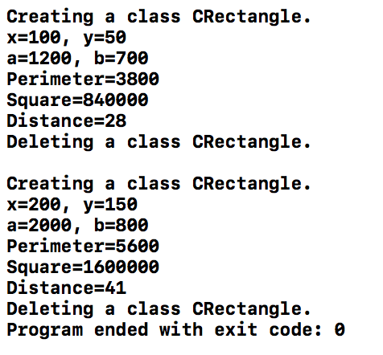
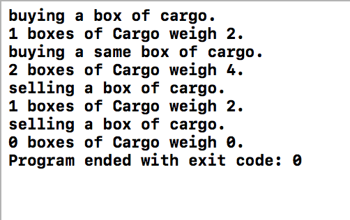
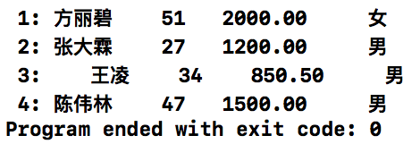
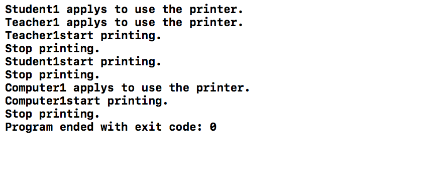

####1.实验一



​	自己写了一个程序，与文档所给代码些许不同

#### 2.实验二



​	在程序中只是定义了析构函数，而没有在main函数的结尾调用析构函数，一旦调用则计数则会出现错误，经过查询资料发现：编译器也总是会为我们合成一个析构函数，并且如果自定义了析构函数，编译器在执行时会先调用自定义的析构函数再调用合成的析构函数），它也不进行任何操作。

​	所以采用编译器自动调用析构函数的形式，没有额外调用析构函数。

####3.实验三



使用模版类的优点：
- 使用模版类，可以减少重复部分，减少源代码量并提高代码的机动性而不会降低类型安全；
- 开发容易，只为类或函数创建一个普通的版本代替手工创建特殊情况处理；
- 理解容易，模板为抽象类型信息提供了一个直截了当的方法；
- 类型安全，模板使用的类型在编译时是明确的，编译器可以在发生错误之前进行类型检查。

#### 4.实验四



​	首先进行定义了用户类，在创建用户类实例时，需要给出用户的优先级别，方便之后使用打印机出现冲突的排队问题。

```c
class user{                           //定义用户类
private:
    char name[80];
    int priviledge;
public:
    char* getname() {return name;}
    int checkP() {return priviledge;}
    void  assign(char  *name, int priviledge)
    {  strcpy(user::name,name);
        user::priviledge=priviledge;
    }
    void  print()
    {  printf("%10s%6d\n",name, priviledge);  }
};
```

​	之后根据实验报告所给出的提示，编写了构造函数是private的printer类，阻止用户建立对象，保证了只有一台打印机。并且在类中设置了表明打印机状态的变量，通过查找变量，用户可以知道当前是否有人正在使用打印机，是否需要等待。

```c
class printer {
    friend void thePrinter(user T);
private:
    printer();
    int state;
public:
    printer(int s):state(s) {}
    int checkstate() {return state;}
    void usingprinter() {state = 1;cout<<"start printing."<<endl;}
    void finishprinting() {state = 0;cout<<"Stop printing."<<endl;}
};
```

​	同时定义了全局函数thePrinter，并且在printer类中被声明为友元函数，让thePrinter避免私有构造含函数引起的限制。thePrinter包含一个静态Printer对象，保证了只有一个对象被建立。

```c
void thePrinter(user T) {
    static printer Printer(0);
    cout << T.getname();
    Printer.usingprinter();     //使用打印机
    usleep(1000000);            //正在使用，延迟10秒
    Printer.finishprinting();   //停止使用打印机
}
```

​	在用户申请时，调用apply函数，将用户插入响应的等待队列中。

```c
void apply(user T) {
    //将请求对象按优先级插入等待队列
    cout << T.getname() << " applys to use the printer." << endl;
    if (T.checkP() == 1) {        //教师插入一级优先级队列
        Q1.push(T);
    } else if (T.checkP() == 2) {    //学生插入二级优先级队列
        Q2.push(T);
    } else {
        Q3.push(T);          //电脑插入三级优先级队列
    }
}
```

​	设定了一个checkline函数，可以不断检查等待队列，如果等待队列不为空，从优先级别高的队列开始，出队用户使用打印机。

```c
void checkline() {  //检查打印机是否有人等待
    user T;
    while (!Q1.isempty()) {         //当一级优先级队列不为空时
        Q1.pop(T);                  //队头出栈
        thePrinter(T);              //使用打印机
    }
    while (!Q2.isempty()) {         //当一级优先级队列为空且二级不为空时
        Q2.pop(T);                  //队头出栈
        thePrinter(T);              //使用打印机
    }
    while (!Q3.isempty()) {         //当一二级优先级队列为空且三级不为空时
        Q3.pop(T);                  //队头出栈
        thePrinter(T);              //使用打印机
    }
}
```

​	最后用main函数模拟了一个申请打印的过程，例如：当学生1和老师1同时申请使用打印机时，将其都插入等待队列，比较优先级，使用打印机。在两人使用完打印机之后，计算机1申请使用打印机1，将其插入等待队列，判断没有其他人在等待，计算机1开始打印。

​	需要注意的是，实际应用中，应该写成两个程序，checkline()函数应该独立出来，并在后台一直运行，只要等待队列不为空，则让优先级最高并且最先来的用户使用打印机。在此简化了该过程。

```c
int main()
{
    user u1,u2,u3;
    u1.assign("Teacher1",1);
    u2.assign("Student1",2);
    u3.assign("Computer1",3);
    apply(u2);       //Student1申请使用打印机，将其插入等待队列
    apply(u1);       //Teacher1申请使用打印机，将其插入等待队列
    //没有其他人申请打印机
    checkline();
    apply(u3);
    checkline();
    return 0;
}
```

​	其他还有的解决方案可以是设置一个全局变量记录打印机状态，当打印机处于没有人使用的状态时，就可以创建一个打印机的实例，进行打印的操作；当打印机处于正在使用的状态时，用户就需要进行等待，直到打印机可以被使用，才能创建一个打印机的实例，进行打印操作。通过这样的方式，保证了每个时刻最多有一个打印机工作，即一共只有一台打印机。

​	这样的设计思路，极易出现错误现象，因为其不像上述设计的思路一样，严格保证了打印机的实例只有一个，即只有一个打印机，且当创建超过一个打印机实例时，就会报错。