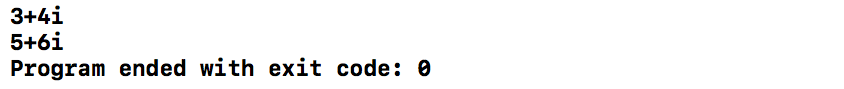
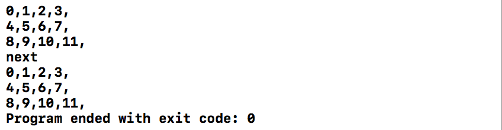
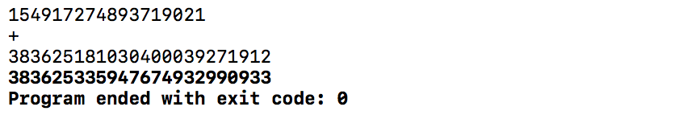
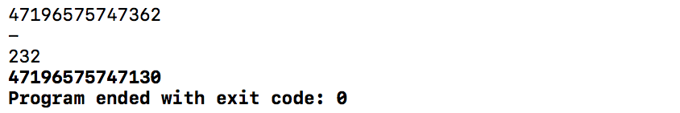
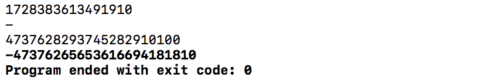
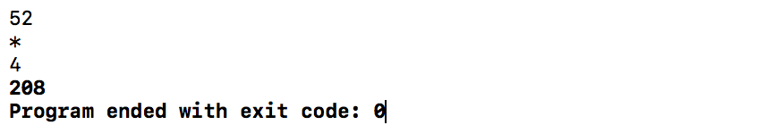
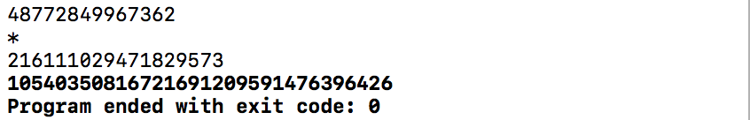
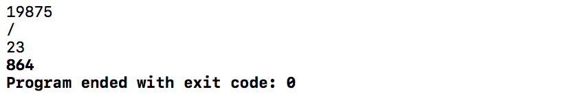
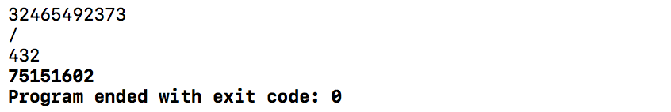
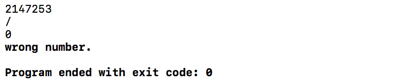

# 实验4

## 实验4.1

|          输出           |
| :-------------------: |
|  |

## 实验4.2

|          输出           |
| :-------------------: |
|  |

## 实验4.3

|               加法                |
| :-----------------------------: |
|  |

|                   减法                    |
| :-------------------------------------: |
|          |
|                 被减数小于减数                 |
|  |

|               乘法                |
| :-----------------------------: |
|        |
|              大数乘法               |
|  |

|                    除法                    |
| :--------------------------------------: |
|               |
|                   大数除法                   |
|         |
|                   除数为零                   |
|  |

## 实验4.4

|          输出           |
| :-------------------: |
|  |

