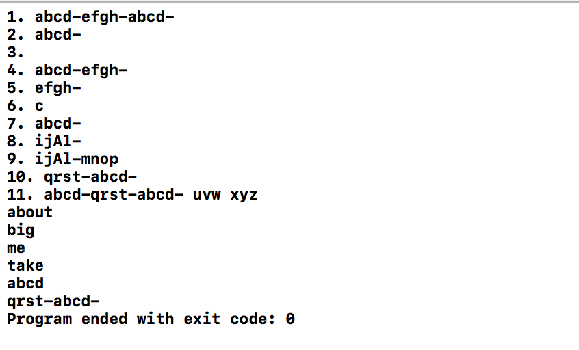

# 实验5

## 实验5.1

|          输出           |
| :-------------------: |
|  |

尽管从正方形是特殊的矩形这个角度来看，正方形可以作为矩形的派生类，但对于正方形来说，`setWidth()`和`setHeight()`是冗余的，且容易引起错误，违反了LSP原则。所以正方形不能继承矩形。解决方案：创建一个新的抽象类作为正方形和矩形的父类，将矩形和正方形的共同行为，即正方形的边长/矩形的宽移动到这个抽象类中，矩形中单独定义长。

## 实验5.2

|          输出           |
| :-------------------: |
|  |

## 实验5.3

|          输出           |
| :-------------------: |
|  |