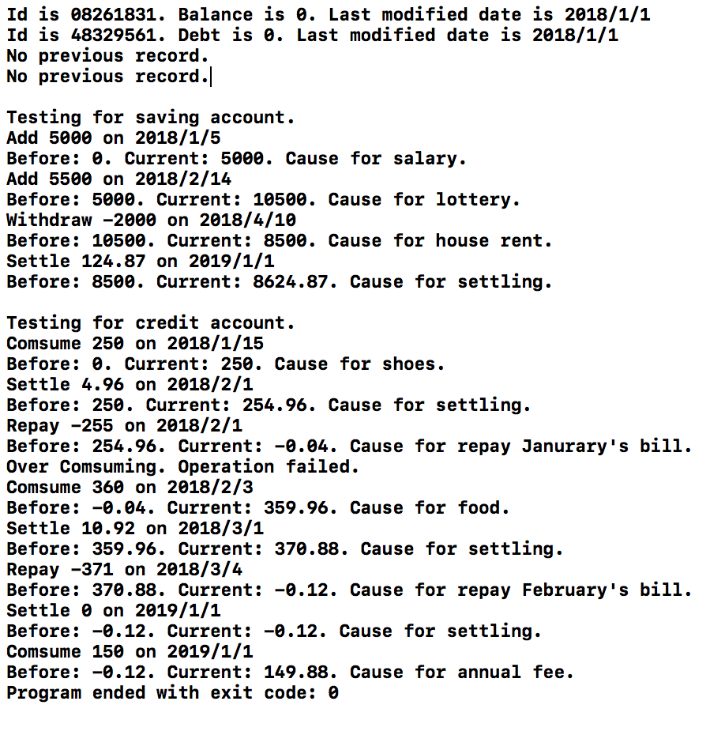
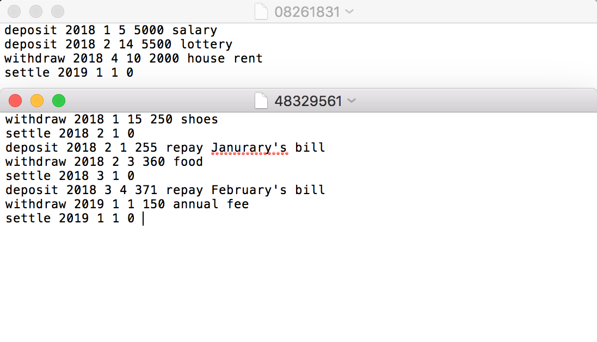
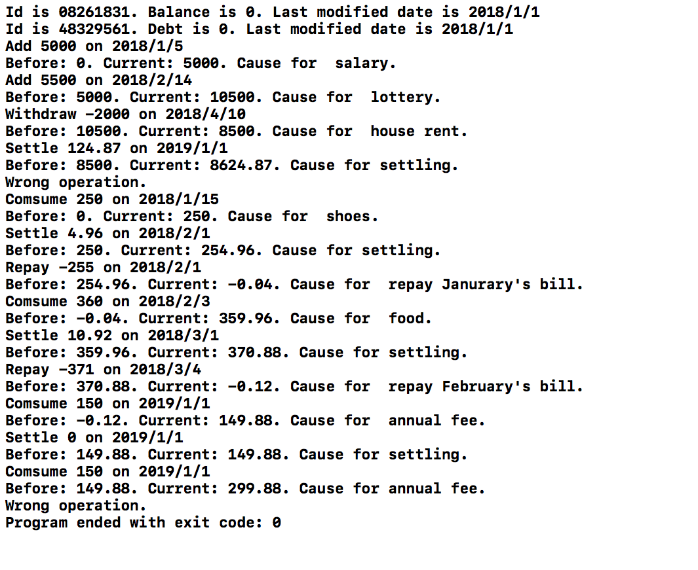

# 实验6

## 实验6.1

|           首次运行            |
| :-----------------------: |
|  |
|         首次运行后的文件          |
|  |
|           再次运行            |
|  |

## 实验6.2

```cpp
// Input Sample
1
50 7 12 10 2000
40 25 30 35 45
15 20 12 17 13
```

样例输出附上文件“out_example”。具体代码分析和结果分析附在最后大作业的分析文档中。